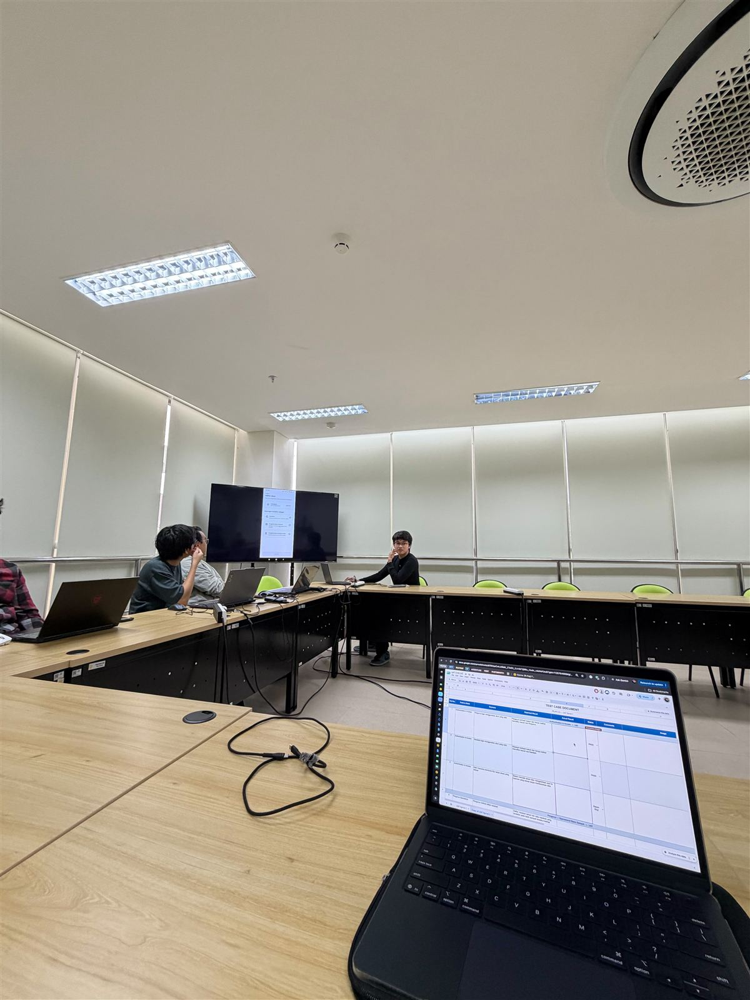
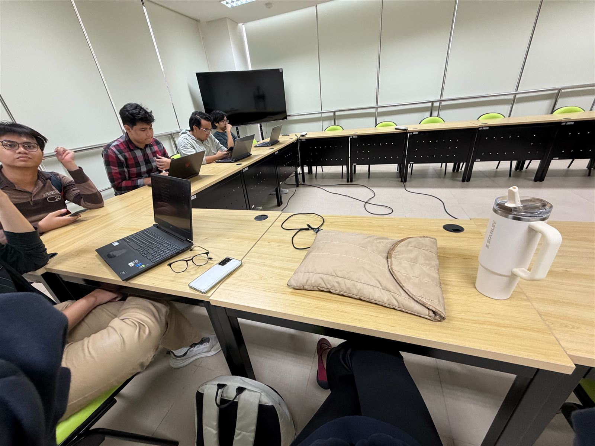

# Work Log

What was done, when, and how long it took.

**How durations are measured:** from the timestamps of the Claude Code session and the commits, grouped into blocks separated by gaps of more than 45 minutes. Times are WIB. Rows marked *self-reported* use my own figure, and rows marked *estimate* cover work with no session behind it (for example decisions settled on Discord). The log covers hands-on development work and, from 28 Sep, the offline team sessions (UAT and standup); other meetings and offline reading are not included.

## Summary

| Week | Work time |
|---|---|
| 15–21 Sep | 3 h 45 min |
| 22–28 Sep | 19 h 40 min, of which 3 h is the offline UAT and standup |
| **Total** | **23 h 25 min** |

Rows are grouped by the date the work happened. The IR pages group the same work differently: PIL-176 is claimed in [week 1](../review/index.md), and PIL-222 — started late on 22 Sep, reviewed and finished afterwards — in [week 2](../review-week-2/index.md), together with PIL-230 and the second review round on PIL-176.

## Week of 15–21 Sep

| Date | Time | Duration | Work | Output |
|---|---|---|---|---|
| Wed 16 Sep | — | not tracked | Drafted the PIL-176 task plan: scope, data model, API contract, test list, open questions | [Task plan](../sprints/sprint-1/tasks/PIL-176-pencatatan-pencairan-plan.md) |
| Thu 17 Sep | 14:18–14:38 | 20 min | Set up the workspace workflow notes; reviewed the sprint plan and listed questions for the team; checked Sprint 1 status in Linear; fixed `git fetch` (missing GitHub host key); moved both app repos to `staging` | — |
| Sun 20 Sep | 15:02–16:38 | 1 h 36 min | Recorded the PO's answers; **built the PIL-176 backend test-first** (model, atomic service, API, saldo-history fix); opened the PR; resolved the migration clash with #18 by stacking and renumbering; verified a from-scratch migrate; updated docs | [pilah-be #19](https://github.com/bank-sampah-PILAH/pilah-be/pull/19) |
| Mon 21 Sep | 19:43–21:32 | 1 h 49 min | **Addressed Heraldo's review**: 3 findings, each fixed test-first and answered in its thread; rebased onto the updated #18; prepared the daily scrum update; analysed test coverage | [Review threads](https://github.com/bank-sampah-PILAH/pilah-be/pull/19) |

## Week of 22–28 Sep

| Date | Time | Duration | Work | Output |
|---|---|---|---|---|
| Tue 22 Sep | 01:24–01:31 | 7 min | Removed an unreachable code branch; added the missing `pencairan` check to `reset_testing_data` (test first); pushed the docs update | [`bd38dc6`](https://github.com/bank-sampah-PILAH/pilah-be/commit/bd38dc6), [`b98a29b`](https://github.com/bank-sampah-PILAH/pilah-be/commit/b98a29b) |
| Tue 22 Sep | 13:05–15:51 | 2 h 46 min | Fixed a test that failed on Postgres only; retargeted #19 to `staging`; produced coverage reports (HTML, JSON, diff-cover); collected SonarQube evidence; built the coverage evidence page and the Individual Review pages; published the redacted AI prompt history | [Coverage evidence](../sprints/sprint-1/evidence/PIL-176-coverage.md), [Individual Review](../review/index.md) |
| Tue 22 Sep | from 19:16 | ≈ 3 h *(self-reported)* | **Built the PIL-176 mobile side test-first**: installed Flutter 3.38.3 to match CI; scaffolded with the SPL CLI; nominal validation, data layer, form cubit, form page, entry point (24 tests); opened the PR | [pilah-mobile #26](https://github.com/bank-sampah-PILAH/pilah-mobile/pull/26) |
| Tue 22 Sep | 20:25–20:58 | 33 min | Requested review from Heraldo on both PRs; renamed both PRs to the `PIL-XXX:` title format; updated the Individual Review pages | — |
| Tue 22 Sep | 21:00–23:11 | 2 h 11 min | **Built PIL-222 test-first on both sides**: periode and nasabah-name filters on the pencairan list, reusing the transaksi period logic; riwayat screen for the whole bank and per nasabah, with grouping and a detail sheet; opened both PRs stacked on PIL-176 | [pilah-be #32](https://github.com/bank-sampah-PILAH/pilah-be/pull/32), [pilah-mobile #27](https://github.com/bank-sampah-PILAH/pilah-mobile/pull/27) |
| Wed 23 – Thu 24 Sep | 23:32–00:48, 12:58–15:17 | 2 h 44 min | **Answered Heraldo's review of all three open PRs**: verified each of the 8 findings against the code, fixed them test-first, replied in each thread; diagnosed why the mobile SonarQube project analyses no Dart; reorganised the IR pages into week 1 and week 2 | [Review threads](https://github.com/bank-sampah-PILAH/pilah-mobile/pull/27), [`a6cdfe6`](https://github.com/bank-sampah-PILAH/pilah-mobile/commit/a6cdfe6) |
| Thu 24 Sep | from 17:33 | 15 min *(estimate)* | Checked whether PIL-230 could start: Linear status (unassigned, no description) and readiness of the four PIL-176/222 PRs (CI, merge state, open threads, approvals); found the ticket's "edit" conflicted with the SDS's append-only rule and listed the options | — |
| Fri 25 Sep | 19:34, 22:35–23:09 | 35 min | Re-read PIL-230 after Tristan's description (edit + versioning); scoped it into a revision table, saldo recompute and endpoints; requested Tristan's review of #19 through the `ask-for-review` skill; wrote the 3P update | [pilah-be #19](https://github.com/bank-sampah-PILAH/pilah-be/pull/19) |
| Sat 26 Sep | — | 30 min *(estimate)* | **Settled PIL-230's open questions** with the PO (Talitha) and lead (Tristan) on Discord: recompute later snapshots, reason required, 7-day backdating limit, nasabah see only the latest version; recorded the decisions and scope in the Linear issue; noted Tray's prod DB snapshot for migration testing | [PIL-230](https://linear.app/pilah-2/issue/PIL-230) |
| Sat 26 Sep | 19:53–20:58 | 1 h 5 min | **Answered Tristan's review of #19**: verified the 4 findings (nasabah read access, backdated payouts, rounding vs history, admin writes), fixed each test-first, replied in each thread; merged `staging` and added a merge migration for the two `0012` leaves; test-merged every open backend PR against #19 and warned the 9 that will conflict | [pilah-be #19](https://github.com/bank-sampah-PILAH/pilah-be/pull/19), [`290bb1d`](https://github.com/bank-sampah-PILAH/pilah-be/commit/290bb1d) |
| Sat 26 Sep | 20:58–21:35 | 37 min | **Built the PIL-230 backend test-first**: append-only revision table, `PATCH` edit with a ledger replay that recomputes every later snapshot, 7-day backdating limit, revision history endpoint, read-only admin, constant list queries (14 tests); opened the PR stacked on #32 | [pilah-be #52](https://github.com/bank-sampah-PILAH/pilah-be/pull/52) |
| Sat 26 Sep | 21:35–22:05 | 30 min | **Built the PIL-230 mobile side test-first**: edit form with required alasan and a date picker bounded by the backend's limit, change-history page, *Diperbarui* mark and entry points in the riwayat (16 tests); opened the PR stacked on #27 | [pilah-mobile #33](https://github.com/bank-sampah-PILAH/pilah-mobile/pull/33) |
| Sun 27 Sep | 18:43–19:07 | 24 min | Answered a teammate's question on integrating #19 into four nasabah PRs: test-merged each against `staging` and #19, advised keeping them separate (one merge migration at merge time); checked the permission-class agreement against the code and the lead's stacking proposal, and flagged its merge-order and rebase catches | — |
| Mon 28 Sep | 15:41–16:36, 20:22–20:50 | 1 h 23 min | Confirmed all six pencairan PRs were squash-merged to `staging` and live on the staging API; set up an Android emulator for testing the staging APK (diagnosed a crash to disk space and an off-screen window); wrote the 3P; built the week-2 AI Literacy page and its redacted prompt history | [AI Literacy](../review-week-2/part-b/ai-literacy.md) |
| Mon 28 Sep | — | 3 h *(self-reported)* | **Offline UAT and standup session** with the team: walked through the UAT test case document for Sprint 1, checked features on the shared screen, and gave the standup update | Photos below |

### Offline UAT and standup — 28 Sep

