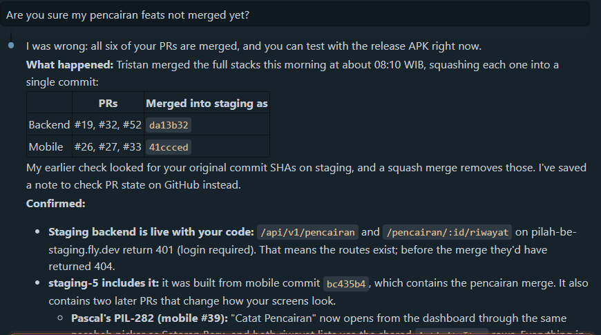

# AI Literacy

!!! success "Competency level: 3"
    AI used critically: its claims checked against the code, GitHub and logs before being acted on, its direction corrected where it drifted from team decisions, and the prompt history published with personal data removed.

## How AI was used

- **Tool:** Claude Code as an agent in VS Code, across `pilah-be`, `pilah-mobile`, `pilah-docs` and Linear (through Composio): reading code, running tests and CI-equivalent checks, committing, opening PRs, replying to reviews.
- **Guardrails:** the workspace skills (`tdd`, `ship`, `ask-for-review`), CI on Postgres, and standing rules I gave it this week and asked it to remember: phase-tagged TDD commits, replying inside each review thread, never merging branches (the lead does), and 3P updates in Bahasa.
- **My role:** relaying and deciding requirements with the PO and lead, choosing between options it laid out, approving outward actions (pushes, PR comments, Linear edits), and asking "are you sure?" when a claim mattered.

## 24–28 Sep — where verification changed the outcome

| Situation | What verification found |
|---|---|
| The AI told me my pencairan PRs were **not merged**, because my commit SHAs were not on `staging` | I asked "are you sure?". Rechecked through the PRs themselves: all six were merged that morning, squashed by the lead into one commit per repository, so my SHAs could never appear. Confirmed by content too: the staging API answers 401, not 404, on the new routes. The AI saved the rule "check PR state, not SHA ancestry" |
| The AI's reading of the PO's "7-day" rule combined two limits (an edit window *and* a backdating limit) | I corrected it: follow the PO's answers only. The Linear decisions were rewritten to her wording before any code was written |
| Recording a PR comment promising to merge #19 into my stacked #32 | I stopped it: merges belong to the lead. The comment was edited and the rule saved |
| A Discord agreement to adopt a teammate's `IsActiveNasabah` class | Checked against the code instead of taking the chat at face value: `staging` already had an equivalent `IsNasabahRole`, and JWT authentication already rejects inactive users, so the extra `is_active` check added nothing. The agreement was out of date before anyone acted on it |
| Four review findings from the lead on #19 | Each was reproduced before being fixed: the red tests showed history at Rp 7.001 against a stored Rp 7.000,50, a backdated payout accepted with 201, and a nasabah refused with 403 |
| A local test failed after merging `staging` | Diagnosed as my local `.env` enabling debug mode, and proved by rerunning with `.env` moved aside, instead of "fixing" a correct test |
| #19's diff coverage read 97% | Every uncovered line was traced with `git blame` to code merged in from `staging` by other members; the four fixes themselves are fully covered, and the page says exactly that rather than claiming 97% or 100% |
| A production database dump pasted into the chat for migration testing | The AI flagged that it held real names, emails, phone numbers and unexpired refresh tokens; it is kept out of every repository, and it is removed entirely from the published prompt history below |
| Test counts drafted for the IR pages | The AI caught its own error before publishing: the mobile baseline was 278, not 270, so PIL-230 added 16 tests, not 24 |
| The emulator "just closed" | Diagnosed from the emulator's verbose log (12 GB needed, 2.9 GB free on C:) instead of reinstalling; the invisible window was found at y = −947 and moved on screen |
| A chat export offered as AI-literacy evidence | Checked before use: it held only a startup banner from another session, so the history was built from this session's own transcript instead |

## Example: challenging "your PRs are not merged yet"

When I asked whether I could test my features with the release APK, the AI answered confidently that my pencairan PRs were not on `staging`: its check looked for my own commit SHAs there and found none.

That contradicted what I knew from the team (the lead had said he was merging my stack), so I asked it directly: *"Are you sure my pencairan feats not merged yet?"*

{ width="620" }

Rechecking through the PRs themselves instead of through git ancestry showed:

- All six PRs (backend #19, #32, #52 and mobile #26, #27, #33) had been merged that morning. The lead squash-merged each stack into one commit (`da13b32`, `41ccced`), which is exactly why my original SHAs could never appear on `staging`.
- The code was live: the staging API answered **401** (login required) on `/api/v1/pencairan` and `/pencairan/:id/riwayat`, where an unmerged route would answer 404.
- The latest staging APK already contained the features, so I could test that day instead of waiting.

The AI acknowledged the mistake plainly ("I was wrong") and recorded the lesson as a standing rule: check merge state through the PR, then confirm by content, never by commit ancestry alone.

## Example: deciding instead of accepting the first design

PIL-230 first said only "edit pencairan". The AI's first analysis laid out three options (edit only non-money fields, correct through reversal entries as the SDS's append-only rule suggests, or edit in place) and pointed out the conflict with the SDS. I did not pick from that list on my own: I took the open questions to the PO and lead, the lead and PO disagreed on whether nasabah see old versions, and I chose the PO's version with the lead's approval. The AI then turned the decisions into a design and asked me where the answers still left room:

- Should a backdated **new** payout be validated at its date, or rejected before the nasabah's last activity? I chose rejecting, which keeps every receipt exact.
- May a pengurus edit a pencairan of a nasabah who is no longer active? I chose yes, and asked whether it could change later; the check lives in one query.
- Should recomputed later pencairan be marked as edited? I chose no.

## Prompt history

**[Full prompt history (24–28 Sep 2026)](ai-prompt-history.html)**: the Claude Code session behind PIL-230 and the second PIL-176 review round.

- Each prompt and reply is shown in full, with a timestamp.
- Each tool call (command, file edit, Linear query) is shown as one line stating what was run and why.
- Omitted: screenshots, the model's internal reasoning, raw command output, and a pasted production database dump (personal data).
- Redacted: webhook URLs, email addresses other than my own, phone numbers, access tokens and password hashes.
