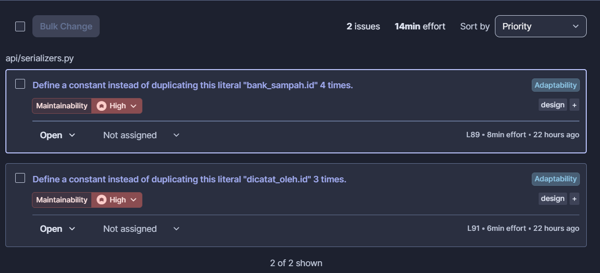

# Code Quality

!!! success "Competency level: 3"
    Every CI quality check passes on the PIL-222 and PIL-230 PRs, and I traced why the mobile SonarQube project reports nothing at all. SonarQube found two maintainability issues on my serializer code; both are fixed in [pilah-be #67](https://github.com/bank-sampah-PILAH/pilah-be/pull/67), which is **not merged yet**, so they still show as open on `pilah-be-staging` until it is.

## Automated checks in CI, all passing

**Backend ([#32](https://github.com/bank-sampah-PILAH/pilah-be/pull/32)):** `ruff check`, `ruff format --check`, `mypy --strict`, `makemigrations --check`, `manage.py check --deploy`, coverage ≥ 80% (91%, diff coverage 100%).

**Mobile ([#27](https://github.com/bank-sampah-PILAH/pilah-mobile/pull/27)):** `flutter analyze --fatal-infos`, `dart format --set-exit-if-changed`, coverage and diff-coverage gates (35.3% overall, 87.5% diff).

**PIL-230, backend ([#52](https://github.com/bank-sampah-PILAH/pilah-be/pull/52)):** the same checks as #32, all passing in CI on Postgres; 92% overall, **100% diff coverage**.

**PIL-230, mobile ([#33](https://github.com/bank-sampah-PILAH/pilah-mobile/pull/33)):** `dart format`, `flutter analyze --fatal-infos` clean, 294 tests; 37.8% overall, **82.8% diff coverage**. Run locally on Flutter 3.38.3, the CI version.

## Quality of the change itself

The period filter was **shared, not copied**. The transaksi list already had the date-range logic, so it was generalised with a `TypeVar` bound to `Model` and reused, instead of duplicating four period branches:

```python
_Dated = TypeVar("_Dated", bound=Model)

def apply_period(queryset: QuerySet[_Dated], request: HttpRequest,
                 default: str | None = "hari_ini") -> QuerySet[_Dated]:
```

All 68 pre-existing transaksi period tests still pass, which is what makes the generalisation safe to claim.

## Diagnosing the mobile SonarQube project

The SonarQube check on #27 failed, and the mobile dashboard showed "The main branch has no lines of code". Rather than re-running until it passed, I read the logs:

1. The failed run never reached the server — `Connect timed out` on its first call to `/api/server/version`. A re-run passed, so that was infrastructure, not code.
2. The passing run still analysed nothing: `210 files indexed`, then `0 languages detected`. The scanner only looked for Java and Docker files.
3. The same holds on #26 and on other team members' PRs, so the mobile project has **never** analysed Dart. The server has no Dart analyser.

**Consequence for this claim:** a "0 issues" screenshot from the mobile project would be meaningless, so it is not used as evidence. The enforced static analysis for mobile is `flutter analyze --fatal-infos` in CI, which fails the build on infos as well as warnings. Reported to the team so the server can be fixed.

## Backend SonarQube

Two issues on `pilah-be-staging` land on my code, both rule S1192 (duplicated string literal, Maintainability, High) in `api/serializers.py`:

{ width="620" }

**Root cause.** `"bank_sampah.id"` and `"dicatat_oleh.id"` were already repeated as `source` paths across other members' serializers. My `PencairanDetailSerializer` (from #19) added one more of each, which pushed both to Sonar's threshold of 3, and Sonar reports at the first occurrence, which is my line.

**Fix: [pilah-be #67](https://github.com/bank-sampah-PILAH/pilah-be/pull/67), open, not merged yet.**

| Step | Commit |
|---|---|
| Pin the output first: 4 tests fix `bank_sampah_id` / `dicatat_oleh` in all five serializers that use the paths | [`dd9357e`](https://github.com/bank-sampah-PILAH/pilah-be/commit/dd9357e) |
| Define each path once ([`_BANK_SAMPAH_ID`, `_DICATAT_OLEH_ID`](https://github.com/bank-sampah-PILAH/pilah-be/blob/7a4fe58/api/serializers.py#L32-L34)) and use it at all 7 places | [`7a4fe58`](https://github.com/bank-sampah-PILAH/pilah-be/commit/7a4fe58) |

The pin tests were checked to guard the change: pointing `_DICATAT_OLEH_ID` at the wrong field made 2 of them fail. 255 tests pass locally with ruff and format clean.

**Status (28 Sep):** #67's CI is red, but not because of this change. Its only failure is 3 `mypy` errors in `api/management/commands/seed_testing_data.py`, which arrived on `staging` with a direct commit ([`372e921`](https://github.com/bank-sampah-PILAH/pilah-be/commit/372e921)) and have turned `staging`'s own CI red too. Once that is fixed on `staging` and #67 is merged, SonarQube should show no issues on my code.

The other open issues on `pilah-be-staging` are attributed to other team members (Author facet); the setup gaps I found are on the [week 1 page](../../review/part-b/code-quality.md).

## Quality of the PIL-230 change

- **No N+1 on the list.** The two new per-row fields would have added one query each per row. They are annotated on the queryset instead, and a test pins the query count ([`0ea7252`](https://github.com/bank-sampah-PILAH/pilah-be/commit/0ea7252) → [`7bceb58`](https://github.com/bank-sampah-PILAH/pilah-be/commit/7bceb58)); details on the [Programming](programming.md) page.
- **No copied rules.** Recording and editing share the nominal and tanggal validators, on both backend and mobile (`PencairanValidator.nominalEdit` states why the edit check is weaker: the backend replay is the authority on saldo).
- **Generated code kept out of the diff.** `build_runner` rewrites the whole of `di.config.dart` on Windows. Committing that would have buried two real registrations in 68 lines of reordering, so only the two new `gh.factory` registrations were added.
- **Tests placed to avoid conflicts.** PIL-230's backend tests are in a new `api/test_pencairan_edit.py`, since four other open PRs append to `api/tests.py`.
