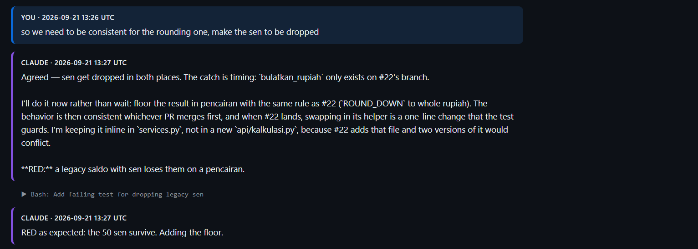

# AI Literacy

**Rubric (Responsible use of AI):** show the type of AI used during development, with the prompt history as evidence.

| Level | Requirement |
|---|---|
| 2 | AI used mostly copy-paste or instant help, without adequate analysis and verification |
| 3 | AI used critically and responsibly; its responses are analysed and critiqued to improve the work |
| 4 | AI used strategically, backed by data; usage patterns tracked and used to improve the workflow |

**Proposed level: 3**

## How AI was used

- **Tool:** Claude Code as an agent in VS Code, working in the repository: reading code, running tests and checks, committing, and opening the PR.
- **Guardrails:** the team's workspace skills (`ship` for the branch/worktree/PR workflow, `tdd` for red-green commits) and CI (ruff, mypy strict, coverage, SonarQube).
- **My role:** deciding scope and priorities, relaying team decisions (stacking on #18, the rounding rule), approving outward actions (force-pushes, PR comments), and asking for verification before trusting results.

## Week of 15–21 Sep — where verification changed the outcome

| Situation | What verification found |
|---|---|
| Asked to renumber the migration to `0012` before #18 merged | It would reference a migration that did not exist yet (`NodeNotFoundError`) and break every test; we stacked on #18 instead |
| "Re-check before making the PR" | Confirmed the branch was current with `staging`, the diff held only the intended files, and no secrets were committed; found a second PR using the same migration number |
| A test written after its fix | Proved it catches the bug by disabling the fix and watching it fail |
| An ordering bug that "seemed fine" | Showed it was nondeterministic: 6 of 10 runs passed before the fix, 10 of 10 after |
| Production environment values considered for local testing | Not used: they would break tests and point local runs at the production database |
| AI's claim that PR #22's rounding needed a PO decision | Corrected after reading #22's code: the policy was already set there |

### Example: correcting the AI's direction on rounding

Review finding 2 was about legacy saldo keeping its sen after a pencairan, while PR #22 rounds sen away on setoran. The AI's first recommendation was to **wait**: it framed the rounding as a decision for the PO, then suggested holding off until #22 merged, because the shared helper `bulatkan_rupiah` only exists on #22's branch.

I decided otherwise: the two money flows should be consistent **now**, and the sen dropped. The AI then:

1. Implemented the decision without waiting for #22, using the same rule inline (`ROUND_DOWN` to whole rupiah), and explained why it did not create its own `api/kalkulasi.py` (it would conflict with #22's file).
2. Wrote the failing test first ("RED as expected: the 50 sen survive") in [`9b135b2`](https://github.com/bank-sampah-PILAH/pilah-be/commit/9b135b2), then the fix in [`2981176`](https://github.com/bank-sampah-PILAH/pilah-be/commit/2981176).
3. Checked that its rounding was identical to #22's (`quantize(Decimal(1), rounding=ROUND_DOWN)`), so swapping in `bulatkan_rupiah` later changes nothing.

The follow-up is recorded publicly in the [review thread](https://github.com/bank-sampah-PILAH/pilah-be/pull/19#discussion_r4062584758): once #22 merges, the inline rounding is replaced with `kalkulasi.bulatkan_rupiah`.

## Week of 22–28 Sep

| Situation | What verification found |
|---|---|
| All tests passed locally on SQLite | CI on Postgres failed: a `flush` inside a transaction is rejected by Postgres. Diagnosed from the CI log and fixed in [`ad7d55f`](https://github.com/bank-sampah-PILAH/pilah-be/commit/ad7d55f). Lesson: local SQLite is not proof; wait for CI |
| A test failed after merging `staging` | Diagnosed as a local `.env` artifact rather than "fixing" the test; confirmed by rerunning the way CI does |
| "100% coverage" | Separated precisely: 100% of my new code vs 90% of the project, measured by two tools that agree |

## Prompt history

**[Full prompt history (17–22 Sep 2026)](ai-prompt-history.html)**: 81 prompts, 243 replies and 328 tool calls from the Claude Code session behind PIL-176.

- Each prompt and reply is shown in full, with a timestamp.
- Each tool call (command, file edit, API query) is shown as one line stating what was run and why, so the verification steps are visible.
- Omitted: screenshots, the model's internal reasoning, and raw command output.
- Redacted: webhook URLs, email addresses other than my own, and access tokens.
