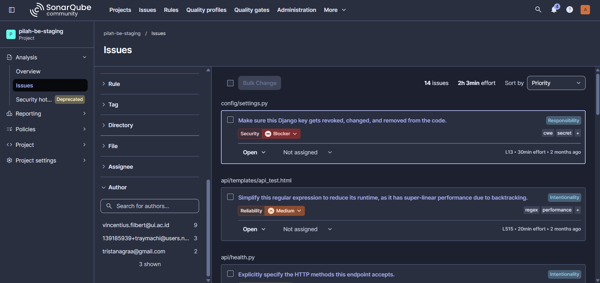
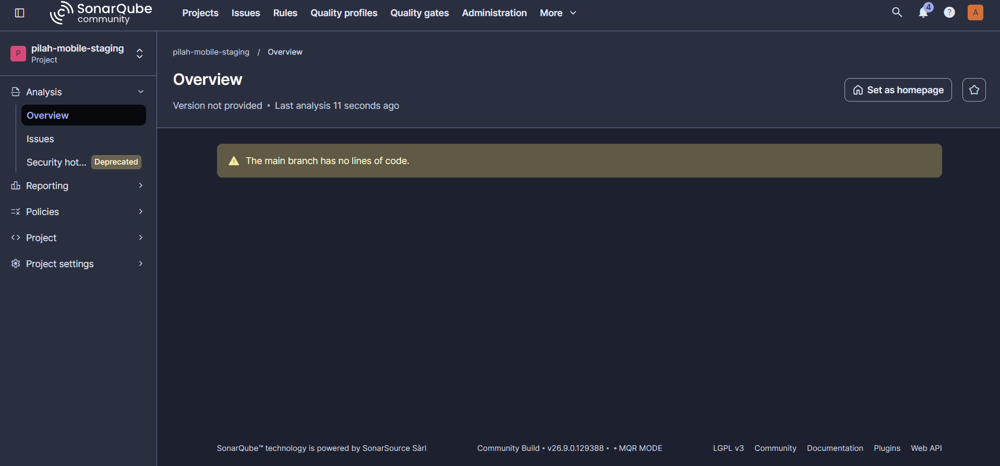

# Code Quality

!!! success "Competency level: 3"
    Every CI quality check passes on all four of my PRs, SonarQube lists no issues authored by me, and I found two gaps in the team's analysis setup.

## Automated checks in CI, all passing

**Backend ([#19](https://github.com/bank-sampah-PILAH/pilah-be/pull/19), [#32](https://github.com/bank-sampah-PILAH/pilah-be/pull/32)):**

- `ruff check` and `ruff format --check`: no issues
- `mypy --strict` (`mypy api config`): no issues
- `makemigrations --check`, `manage.py check --deploy`: clean
- Coverage gate (≥ 80%): passed; my new code is 100% covered ([evidence](../../sprints/sprint-1/evidence/PIL-176-coverage.md))

**Mobile ([#26](https://github.com/bank-sampah-PILAH/pilah-mobile/pull/26), [#27](https://github.com/bank-sampah-PILAH/pilah-mobile/pull/27)):**

- `flutter analyze --fatal-infos`: no issues (infos fail the build too)
- `dart format --set-exit-if-changed`: no changes
- Coverage gates (overall and diff ≥ 25%): passed, diff coverage 88.07% (#26) and 87.5% (#27)

## SonarQube, backend (`pilah-be-staging`)

- The latest analysis ran on `feature/pil-222` (#32), which contains all my backend code from #19 and #32.
- **None of the 14 open issues are mine.** The Author facet attributes them to three other team members (9 + 3 + 2); my account does not appear.

## Gaps found in the analysis setup

1. **Backend coverage misses `config/`.** CI measures coverage with `--source=api`, but SonarQube also analyses `config/`, so `config/` lines always show 0%. Changing CI to `--source=api,config` would make SonarQube's numbers accurate for the whole team.
2. **Mobile SonarQube analyses no code.** Every mobile scan indexes the `lib/` files (210 on #27) but logs `0 languages detected`, so nothing is analysed and the project reports "no lines of code". The same holds on #26 and other team PRs. The server has no Dart analysis, so for mobile the enforced static analysis is `flutter analyze` in CI. Fixing it needs Dart analysis enabled on the server.

## Why a self-hosted SonarQube

The team runs its own SonarQube Community server (`sonar.heraldoarman.com`) instead of the cloud service because the cloud plan needs a paid subscription once a team has more than 5 members, and this team is larger than that. Self-hosting keeps the same analysis — CI reports every branch to it — at no cost.

## Local tooling

- SonarQube for IDE (VS Code, 5.10) installed to catch issues while coding.
