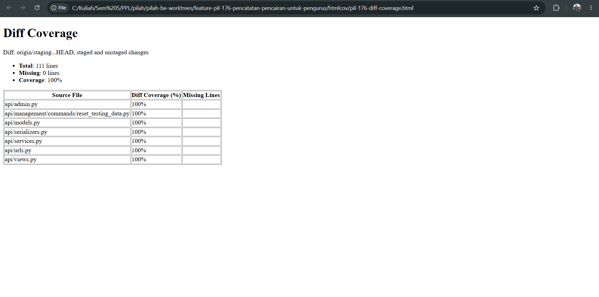
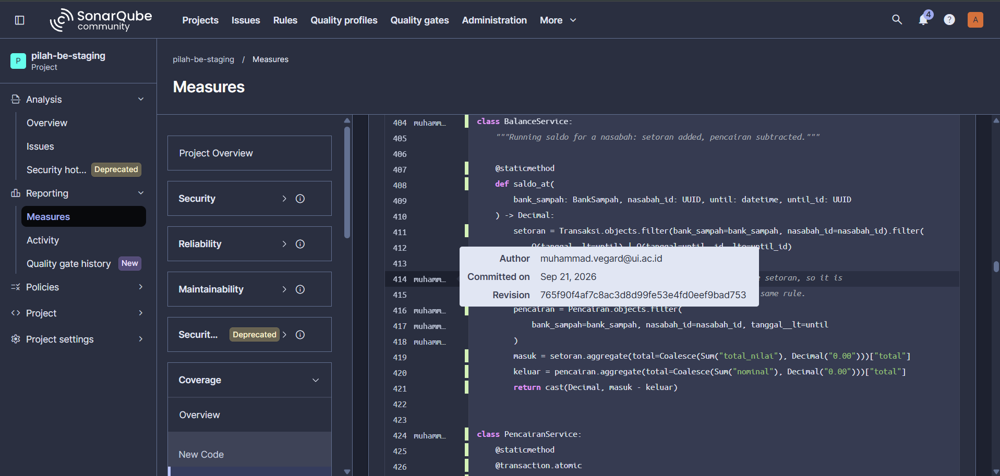
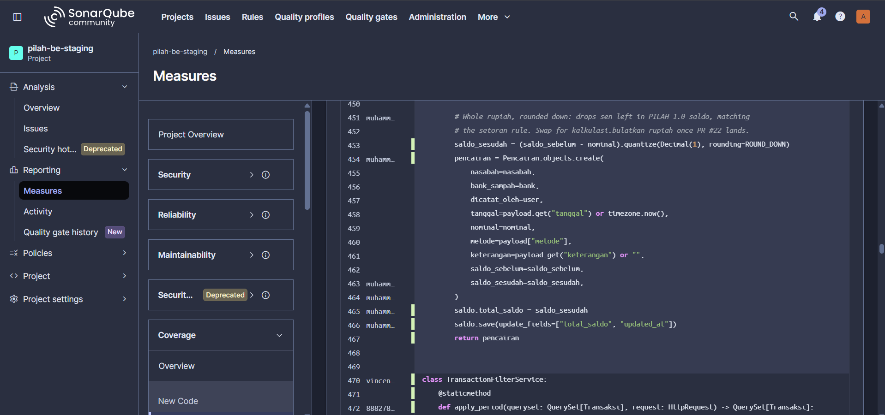
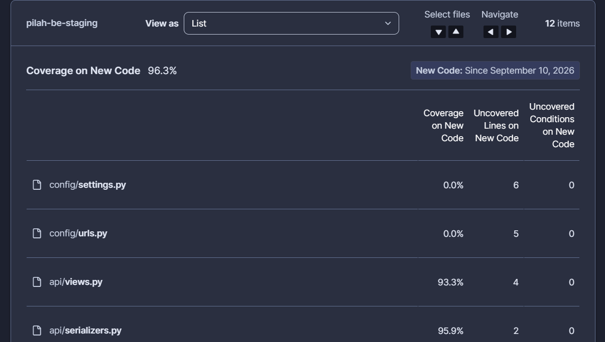
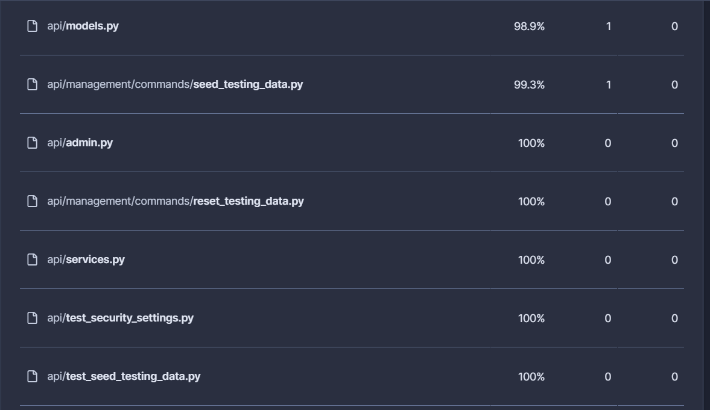
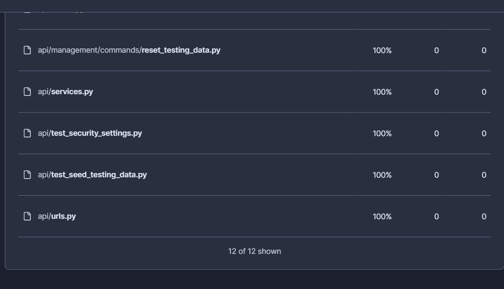

# Test Driven Development

!!! success "Competency level: 3"
    100% of my new backend code covered, disciplined red-green commits, positive, negative and corner cases, and mock-based test isolation.

## Coverage proof

- **My changes: 111 of 111 statements covered (100%).** Whole backend: 90%.
- Full evidence, with how it was measured and a line-by-line breakdown: [PIL-176 Coverage](../../sprints/sprint-1/evidence/PIL-176-coverage.md)
- HTML report: [pil-176-diff-coverage.html](../../sprints/sprint-1/evidence/pil-176-diff-coverage.html)

### diff-cover: only the lines I changed

Coverage of only the lines my branch changes against `staging`, excluding tests and migrations.

### SonarQube: my code, covered, with authorship

`BalanceService`: the tooltip shows me as the author (revision `765f90f`); every executable line has a green (covered) bar.

`PencairanService.create_pencairan`: rounding, record creation and saldo update, all covered. Line 470 onward belongs to another author.

### SonarQube: Coverage on New Code, all 12 files

The rows below 100% (`config/`, `views.py`, `serializers.py`, `models.py`, `seed_testing_data.py`) are uncovered lines written by other team members since 10 Sep, traced with `git blame` on the [evidence page](../../sprints/sprint-1/evidence/PIL-176-coverage.md#cross-check-with-sonarqube). My lines in those files are covered.

## 15–21 Sep — red-green pairs

Each behaviour is a failing `test(...)` commit followed by the `feat(...)`/`fix(...)` commit that makes it pass.

| Behaviour | Red | Green |
|---|---|---|
| Recording a pencairan lowers the saldo exactly once | [`72dcc72`](https://github.com/bank-sampah-PILAH/pilah-be/commit/72dcc72) | [`fbab07b`](https://github.com/bank-sampah-PILAH/pilah-be/commit/fbab07b) |
| Nominal above the saldo is rejected, saldo unchanged | [`0e7a3f3`](https://github.com/bank-sampah-PILAH/pilah-be/commit/0e7a3f3) | [`e65ff1d`](https://github.com/bank-sampah-PILAH/pilah-be/commit/e65ff1d) |
| Zero/negative/decimal nominal and future `tanggal` rejected | [`f876c63`](https://github.com/bank-sampah-PILAH/pilah-be/commit/f876c63) | [`6615dc8`](https://github.com/bank-sampah-PILAH/pilah-be/commit/6615dc8) |
| Detail readable only within the bank (404/403/401) | [`9377c90`](https://github.com/bank-sampah-PILAH/pilah-be/commit/9377c90) | [`cb9da4a`](https://github.com/bank-sampah-PILAH/pilah-be/commit/cb9da4a) |
| Saldo history subtracts pencairan | [`575d0f6`](https://github.com/bank-sampah-PILAH/pilah-be/commit/575d0f6) | [`5447710`](https://github.com/bank-sampah-PILAH/pilah-be/commit/5447710) |
| List filtered by nasabah | [`9c40890`](https://github.com/bank-sampah-PILAH/pilah-be/commit/9c40890) | [`999882b`](https://github.com/bank-sampah-PILAH/pilah-be/commit/999882b) |
| Pending/rejected nasabah cannot be paid out *(review finding)* | [`9ee3525`](https://github.com/bank-sampah-PILAH/pilah-be/commit/9ee3525) | [`49cd153`](https://github.com/bank-sampah-PILAH/pilah-be/commit/49cd153) |
| Same-instant setoran/pencairan ordered deterministically *(review finding)* | [`7ff2cdf`](https://github.com/bank-sampah-PILAH/pilah-be/commit/7ff2cdf) | [`765f90f`](https://github.com/bank-sampah-PILAH/pilah-be/commit/765f90f) |
| Legacy saldo with sen rounded down *(review finding)* | [`9b135b2`](https://github.com/bank-sampah-PILAH/pilah-be/commit/9b135b2) | [`2981176`](https://github.com/bank-sampah-PILAH/pilah-be/commit/2981176) |

## 22 Sep

| Change | Commits |
|---|---|
| Reset command must report leftover pencairan (red → green) | [`f147fe3`](https://github.com/bank-sampah-PILAH/pilah-be/commit/f147fe3) → [`b98a29b`](https://github.com/bank-sampah-PILAH/pilah-be/commit/b98a29b) |
| Refactor: remove unreachable list branch, tests stay green | [`bd38dc6`](https://github.com/bank-sampah-PILAH/pilah-be/commit/bd38dc6) |

## Test cases

- **Positive:** saldo lowered once; list filtered by nasabah; detail readable within the bank.
- **Negative:** nominal above saldo; zero, negative or decimal nominal; future `tanggal`; invalid `metode`; another bank's nasabah; inactive, pending or rejected nasabah; outsider 404, superadmin 403, unauthenticated 401.
- **Corner:** saldo history after a pencairan (API and Excel export); setoran and pencairan at the same instant; legacy saldo with sen.

## Test isolation (mock/stub)

`test_reset_verification_reports_leftover_pencairan` stubs the database flush with `unittest.mock.patch`, so the test isolates the command's verification logic from the flush itself ([`f147fe3`](https://github.com/bank-sampah-PILAH/pilah-be/commit/f147fe3)).

## Test validation

Two tests were checked to prove they catch the bug, not just pass:

- **Export saldo test** ([`8583f90`](https://github.com/bank-sampah-PILAH/pilah-be/commit/8583f90)): with the pencairan merge disabled, it fails (`[200000, 100000] != [140000, 100000]`).
- **Same-instant ordering test:** against the old sort it passed only 6 of 10 runs (nondeterministic); against the fix, 10 of 10.

## Commits that are not red-green pairs

Disclosed for transparency:

| Commit | Why |
|---|---|
| [`1d308eb`](https://github.com/bank-sampah-PILAH/pilah-be/commit/1d308eb) | Corrects an assertion in the first test (the saldo endpoint returns a string) |
| [`8583f90`](https://github.com/bank-sampah-PILAH/pilah-be/commit/8583f90) | Export regression test written after its fix; validated by disabling the fix (above) |
| [`549e765`](https://github.com/bank-sampah-PILAH/pilah-be/commit/549e765) | Migration renumber forced by a merge conflict; verified by a from-scratch `migrate` and CI |
| [`ad7d55f`](https://github.com/bank-sampah-PILAH/pilah-be/commit/ad7d55f) | Test infrastructure fix: the reset test failed on Postgres only |
| [`de50064`](https://github.com/bank-sampah-PILAH/pilah-be/commit/de50064), [`20d9556`](https://github.com/bank-sampah-PILAH/pilah-be/commit/20d9556) | Admin registration and README; no behaviour to test first |
